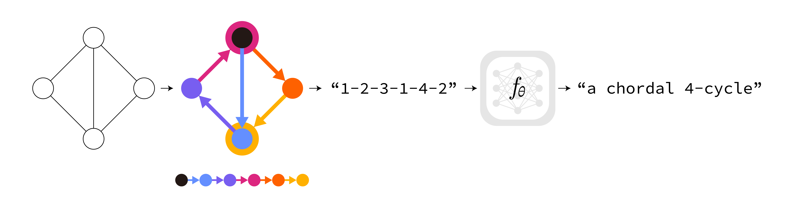

# Random Walk Neural Network (PyTorch)

 \
**Revisiting Random Walks for Learning on Graphs** \
[Jinwoo Kim](https://jw9730.github.io), [Olga Zaghen*](http://bit.ly/olga-zaghen), [Ayhan Suleymanzade*](https://github.com/MisakiTaro0414), [Youngmin Ryou](https://www.linkedin.com/in/miinyou/), [Seunghoon Hong](https://maga33.github.io) (* equal contribution) \
ICML 2024 Workshop on Geometry-grounded Representation Learning and Generative Modeling

(To be updated)
