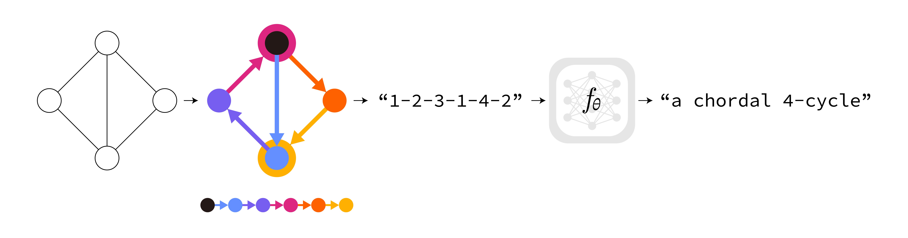

# Random Walk Neural Networks (PyTorch)

[](https://arxiv.org/abs/2407.01214) \
**Revisiting Random Walks for Learning on Graphs** \
[Jinwoo Kim](https://jw9730.github.io), [Olga Zaghen*](http://bit.ly/olga-zaghen), [Ayhan Suleymanzade*](https://github.com/MisakiTaro0414), [Youngmin Ryou](https://www.linkedin.com/in/miinyou/), [Seunghoon Hong](https://maga33.github.io) (* equal contribution) \
ICLR 2025 (Spotlight Presentation)



## Updates

- Mar 4, 2025: Full code release.
- Sep 28, 2024: Released the code for random walks and their records, and DeBERTa experiments.

## Setup

Using `Dockerfile` (recommended)

```bash
git clone https://github.com/jw9730/random-walk.git random-walk
cd random-walk
docker build --no-cache --tag rw:latest .
docker run -it --gpus all --ipc host --name rw -v /home:/home rw:latest bash
# upon completion, you should be at /random-walk inside the container
```

Using `pip`

```bash
git clone https://github.com/jw9730/random-walk.git random-walk
cd random-walk
bash install.sh
```

If using Gaudi v2 HPU accelerators for DeBERTa experiments, additionally run

```bash
pip3 install lightning-habana
```

and change `accelerator:gpu` in `configs/[DATASET]/[MODEL].yaml` to `accelerator:hpu`.

## Experiments

### Mini experiments and measurements

Cover time measurements on lollipop graphs (Section 5.1)

```bash
cd src_analysis
python3 cover_times_measurements_lollipop.py --N 3
python3 cover_times_measurements_lollipop.py --N 4
python3 cover_times_measurements_lollipop.py --N 5
python3 cover_times_measurements_lollipop.py --N 6
cd ..
```

Barbell and Clique experiments (Section 5.1, Appendix A.4)

```bash
cd src_mini
bash run_barbell_clique.sh
cd ..
```

Link prediction experiments on YST, KHN, ADV (Appendix A.7)

```bash
cd src_mini
bash run_link_prediction.sh
cd ..
```

Cover time measurements on SR16 and ogbn-arxiv (Appendix A.8)

```bash
cd src_analysis
python3 cover_times_measurements_sr16.py
python3 cover_times_measurements_arxiv.py
cd ..
```

Effective walk length measurements on CSL, SR16, SR25 (Appendix A.8)

```bash
cd src_analysis
python3 tokenized_walk_lengths_graph_separation.py
cd ..
```

### DeBERTa experiments

Trained model checkpoints can be found at [this link](https://drive.google.com/drive/folders/1gxQfzwLkCWoyG11DGbbzYbo0HyCtiJNG?usp=sharing).
To run testing, please find and download the checkpoints of interest according to the below table.
The download paths can be found at `deberta_download_paths.sh`.
After downloading, you can bypass the training and run the testing code directly.

| Experiment | Download Path |
| --- | --- |
| CSL | `CSL_PATH` |
| SR16 | `SR16_PATH` |
| SR25 | `SR25_PATH` |
| Peptides-func | `PEPTIDES_PATH` |
| Peptides-func (20-samples test outputs) | `PEPTIDES_TEST_OUTPUTS_PATH` |
| 8-cycles counting (graph-level) | `COUNT_8CYC_GRAPH_PATH` |
| 8-cycles counting (vertex-level) | `COUNT_8CYC_VERTEX_PATH` |

Graph isomorphism learning on CSL, SR16, SR25 (Section 5.2, Appendix A.5 and A.8)

```bash
# training
python3 main.py --config configs/graph_separation/csl_deberta.yaml
python3 main.py --config configs/graph_separation/sr16_deberta.yaml
python3 main.py --config configs/graph_separation/sr25_deberta.yaml

# testing
python3 main.py --config configs/graph_separation/csl_deberta.yaml --test_mode --test_batch_size 64 --test_n_walks 4 --test_PATH $CSL_PATH
python3 main.py --config configs/graph_separation/sr16_deberta.yaml --test_mode --test_batch_size 64 --test_n_walks 4 --test_PATH $SR16_PATH
python3 main.py --config configs/graph_separation/sr25_deberta.yaml --test_mode --test_batch_size 64 --test_n_walks 4 --test_PATH $SR25_PATH

# visualization
cd src_analysis
# run attention_vis_graph_separation.ipynb
cd ..

# pre-training ablations (Appendix A.5)
python3 main.py --config configs/graph_separation/csl_deberta_scratch.yaml
python3 main.py --config configs/graph_separation/sr16_deberta_scratch.yaml

# cover time ablations (Appendix A.8)
python3 main.py --config configs/graph_separation/sr16_deberta_no_neigh_record.yaml
```

Graph classification on Peptides-func (Appendix A.7 and A.8)

```bash
# training
python3 main.py --config configs/classification/peptidesfunc_deberta.yaml

# testing
python3 main.py --config configs/classification/peptidesfunc_deberta.yaml --test_mode --test_batch_size 1 --test_n_walks 40 --test_PATH $PEPTIDES_PATH

# testing is computationally expensive for test_n_walks >= 40
# we provide test outputs from the trained model for test_n_walks = 20
# this can be used to evaluate the model performance for up to test_n_walks = 320
# first download the test outputs into $PEPTIDES_TEST_OUTPUTS_PATH and run the following
cd src_analysis
python3 peptides_func_test_ap.py
cd ..
```

Substructure counting on 8-cycles (Appendix A.7)

```bash
# training
python3 main.py --config configs/regression_counting/graph_8cycle_deberta.yaml
python3 main.py --config configs/regression_counting/node_8cycle_deberta.yaml

# testing
python3 main.py --config configs/regression_counting/graph_8cycle_deberta.yaml --test_mode --test_batch_size 8 --test_n_walks 32 --test_PATH $COUNT_8CYC_GRAPH_PATH
python3 main.py --config configs/regression_counting/node_8cycle_deberta.yaml --test_mode --test_batch_size 1 --test_n_walks 16 --test_PATH $COUNT_8CYC_VERTEX_PATH
```

### Llama 3 experiments

Transductive classification on ogbn-arxiv (Section 5.3, Appendix A.6 and A.8)

Transductive classification on Cora (20-shot), Cora, Citeseer, and Amazon Ratings (Appendix A.6)

```bash
cd src_llama3
# follow the instructions in README.md
```

## References

Our implementation is based on the code from the following repositories:

- [graph-walker](https://github.com/kerighan/graph-walker) for random walks
- [BuNN](https://anonymous.4open.science/r/bunn/) for Clique and Barbell experiments
- [LPS](https://github.com/jw9730/lps) for pipelining DeBERTa experiments
- [ELENE](https://github.com/nur-ag/ELENE) for graph separation experiments
- [TSGFM](https://github.com/CurryTang/TSGFM) and [Llaga](https://github.com/VITA-Group/LLaGA) for transductive classification experiments
- [Blog post by Philipp Schmid](https://www.philschmid.de/fsdp-qlora-llama3) for Llama 3 fine-tuning
- [Homomorphism Expressivity](https://github.com/subgraph23/homomorphism-expressivity) for substructure counting experiments
- [LGLP](https://github.com/LeiCaiwsu/LGLP) for link prediction experiments

## Citation

If you find our work useful, please consider citing it:

```bib
@article{kim2024revisiting,
  author    = {Jinwoo Kim and Olga Zaghen and Ayhan Suleymanzade and Youngmin Ryou and Seunghoon Hong},
  title     = {Revisiting Random Walks for Learning on Graphs},
  journal   = {arXiv},
  volume    = {abs/2407.01214},
  year      = {2024},
  url       = {https://arxiv.org/abs/2407.01214}
}
```
